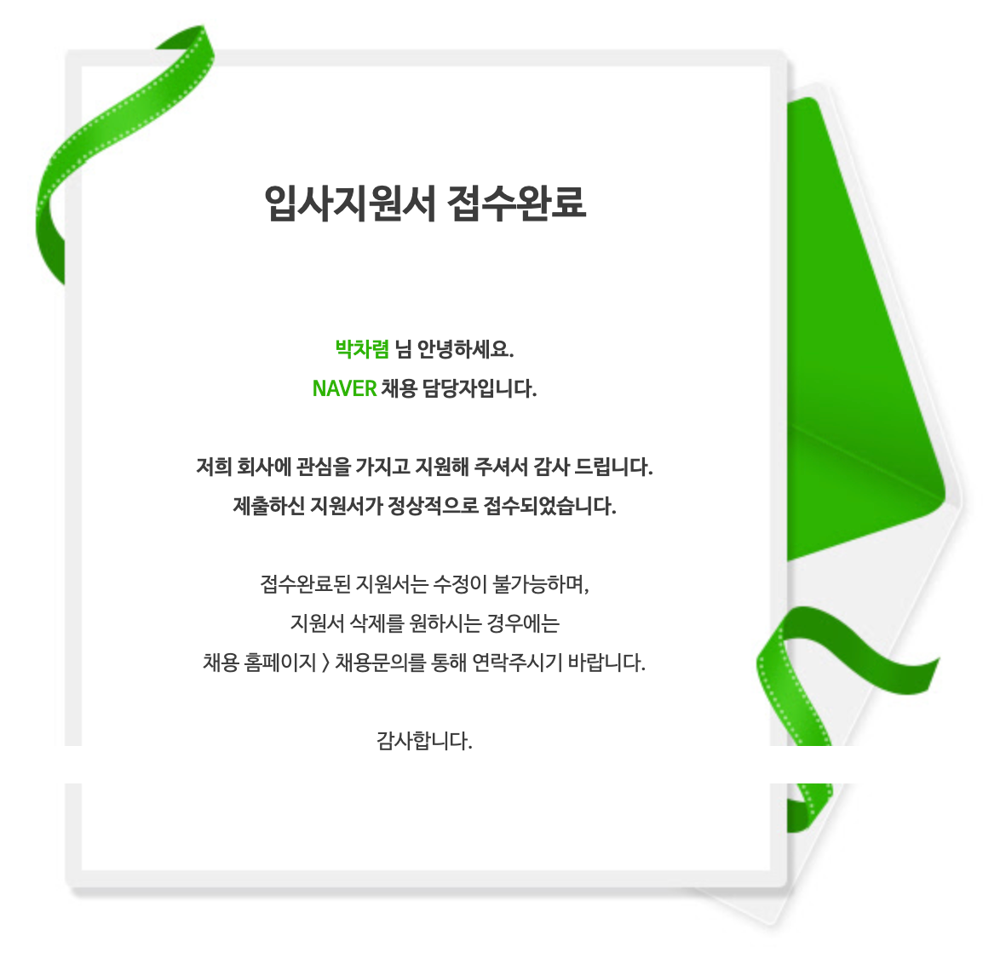
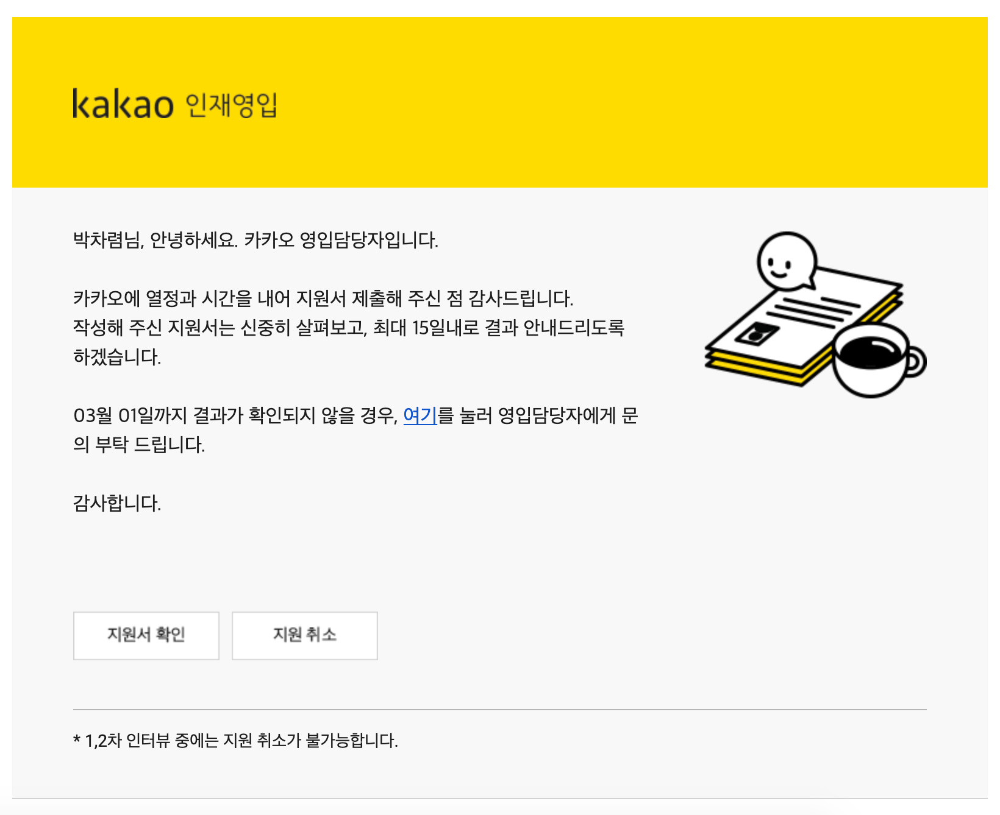
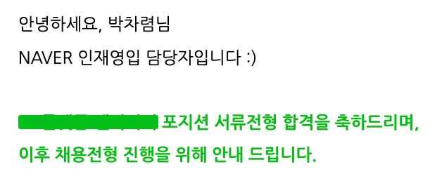
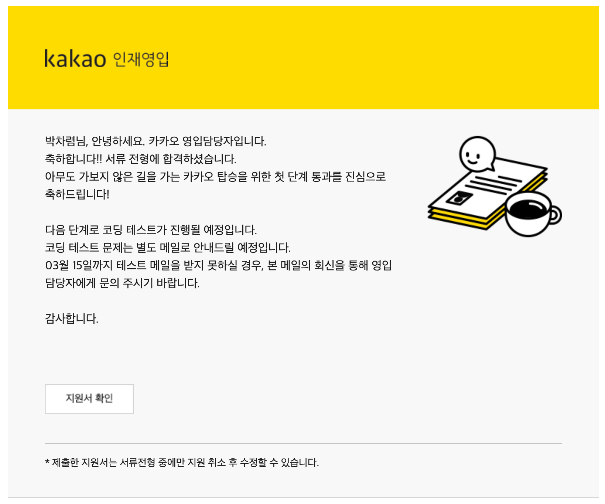

<!--more-->
이번에 이직을 준비하면서 가장 우선시 생각했던 기업이 있다.  
바로 네이버와 카카오이다.  
실제로 내가 일상 생활에서 가장 많이 사용하는 서비스를 제공하는 회사이기도 하고,
개발자라면 누구나 한 번 쯤 꿈에 그리는 직장이라고 생각한다.

나 같은 경우,  
네이버는 대학 시절부터 가고 싶었던 기업이기도 하고 근무 위치도 집에서 가까워 관심이 갔던 기업이며,  
카카오는 3년 재직시 한 달 안식휴가가 파격적으로 느껴졌고 기업에 대한 이미지가 젊고, 영어 호칭을 사용하는 등 전체적인 분위기가 좋아보여서 관심이 갔다.

나는 이번에 이 두 기업을 합쳐서 서류만 여덟 곳 지원, 면접도 열 번 이상 봤으며
합격과 탈락 골고루 경험했고, 최종적으로 입사를 결정한 곳도 존재한다.  
이러한 경험이 도움이 될 지는 모르겠지만 혹시나하는 마음에 지극히 개인적인 견해를 가지고 후기를 남기려고 한다.
말 그대로 지극히 개인적인 후기라 사람마다 도움이 될 수도, 없을 수도 있으므로 가볍게 읽기를 바란다.

참고로 필자의 업무 포지션은 4년차 웹 Front-end 개발 경력직이었으며, 시기는 2019년 11월 ~ 2020년 4월이다.

---

## 지원 페이지
### 네이버
네이버는 간단하게 이메일 주소와 비밀번호 설정만으로 서류 지원이 가능하다.
따라서 이메일이 여러개라면 예전 지원 이력을 숨기거나, 여러 파트를 중복으로 지원할 수 있다.
실제로 이메일 주소가 다르면 예전 이력을 확인할 수 없는 것 같았다.  
또한 본사 외에 분사된 자회사마다 채용 페이지가 따로 존재하였고 모두 동일한 템플릿을 사용하고 있었다.
하지만 템플릿만 같고 이외의 계정 정보나 지원 이력은 모두 법인별로 따로 관리되었다.
(확실하진 않지만 같은 이메일을 사용해도 법인끼리 지원 내역이 공유되지 않아보였다.)

### 카카오
카카오도 마찬가지로 간단하게 이메일 주소와 비밀번호로 회원가입을 해야한다.
하지만 네이버와는 다르게 '동일인이 여러 이메일을 이용하여 지원하는 경우 불이익이 있을 수 있습니다.' 라는 안내를 하고 있다.
따라서 굳이 여러 아이디를 만들어서 지원을 할 필요는 없어보였다.  
카카오도 마찬가지로 본사 외에 분사된 자회사마다 채용 페이지가 따로 존재하였으나, 템플릿이 달랐다.
아마 예측컨데 예전에는 네이버처럼 공통적인 템플릿이 존재했었는데, 이후 카카오 본사가 지원 템플릿을 변경한 것 같다.
따라서 카카오 자회사 끼리는 비슷한 템플릿을 공통으로 사용했지만 카카오 본사 혼자 다른 템플릿이였다.

### 공통
네이버와 카카오 모두 본사와 분사된 자회사 각각 다른 지원 페이지가 존재했고,
법인이 다르면 중복으로 지원이 가능했다.  
또한 법인끼리 지원 내역이 공유되지 않아보였고, 여러 법인의 공고를 동시에 진행할 수 있었다.

---

## 서류
### 네이버
기본 인적 사항과 학력, 최종 경력이 필수 입력이다. 자격증과 추가 포트폴리오는 선택사항이며,
자기소개서는 최소 두 문항에서 많게는 네 문항까지 존재한다.
그 중에서 본인이 보유한 스킬의 활용 정도를 적는 문항은 모든 공고에서 사용되는 공통 문항이다.
(본인이 사용할 수 있는 기술 스킬을 5점 만점으로 점수를 매기는 것)  
이 외에 자기소개서 문항은 지원 동기, 자신의 기술력과 열정을 보여줄 수 있는 활동 이력등 일반적인 자소서 문항들이 존재하였다.

네이버 자소서에 대한 생각은 그다지 중요하지 않은 것 같다는 느낌을 받았다.
기본적인 기술핏이나, 최소 요구사항만 맞는다면 거의 서류에 합격했다.
(만약 서류에서 탈락 되었다면, 요구하는 기술핏 자체가 다른게 아닐까라고 조심스럽게 추측해본다...)  
또한 자소서가 다소 장황하더라도 합격되었으며, 나 같은 경우 포트폴리오를 같이 첨부하였는데 자소서보다 포트폴리오가 더 중요했던 것 같다.

### 카카오
카카오도 기본 인적 사항과 최종 경력은 필수 입력이고, 자격증과 추가 포트폴리오는 선택사항이며, 추가로 네이버와 다르게 학력 또한 선택 사항이다.
또한 자기소개서 항목이 정확히 정해지지 않고 "경력 정보에 참고할 수 있는 자기소개를 작성해주세요" 라는 식으로 자유 형식이다.  
그러나 본사 외에 다른 자회사는 사정이 달랐다. 
일부 자회사는 학력도 필수 입력이였고, 자소서도 따로 문항이 존재했다.
심지어 어떤 법인은 현재 받고있는 연봉도 적어달라는 법인도 존재했다.

카카오 자소서에 대한 생각은 꽤 중요하다고 느꼈다.  
처음에 카카오를 지원할 때 네이버와 비슷하게 생각하여 네이버에서 썻던 자소서를 약간만 변형하여 제출했다.
하지만 바로 서류 탈락을 했다.
이후 몇 일 뒤 모든 항목을 동일하게 작성하고, 자소서만 이전보다 간략하고 핵심 위주로 간결하게 수정하여 제출하였다.
결과는 서류 합격이였다.  
이처럼 네이버에 비해 서류 필터링이 좀 더 깐깐하다고 느꼈다.
(앞서 언급했듯이 지극히 개인적인 의견입니다!)

---

## 서류 응답
### 네이버
서류 결과는 다소 느렸다. 최소 일주일 정도 걸렸고, 길게는 한 달 이상 걸린 공고도 있고, 아예 결과를 주지 않는 공고도 존재했다.

### 카카오
서류 결과가 매우 빨랐다. 최소 이틀에서 15일이 넘지 않았다.  
여기엔 언급하지 않았지만 네이버,카카오 이외의 다른 기업들과 비교해봐도 피드백이 빠른 편에 속했다.  
이 점은 매우 긍정적인 경험으로 남았다.

---

## 사전 테스트

### 네이버
네이버는 법인별로 또는 공고별로 사전 테스트가 있는 곳도, 없는 곳도 있었다.
사전 테스트의 종류는 전화면접, 코딩 테스트가 있었다.

전화면접은 간단한 자기소개부터 그동안 해왔던 이력에 대한 내용의 질의응답이 진행되었다.
개인적으로는 전화면접이나 화상면접이 나와 별로 맞지 않는다고 느꼈다.
그 이유는 뭔가 긴장감이 떨어지다보니, 집중력도 약해지고 내가 무슨 대답을 하고 있는지 내 자신도 모르는 경우가 많았다.
때문에 전화면접이나 화상면접을 본 공고는 거의 다 떨어졌었다.

내가 본 네이버 코딩테스트는 [프로그래머스](https://programmers.co.kr/)와 [코딜리티](https://www.codility.com/)에서 진행되었다.
프로그래머스에서 본 공고는 알고리즘 4문제를 170분간 풀었으며, 코딜리티는 알고리즘 3문제와 객관식 10문제를 115분간 풀었다.
두 가지 모두 난이도가 그렇게 어려운 수준은 아니였으나, 내가 코테를 잘 못해서 둘 다 다 맞추진 못했다.
그러나 의아하게(?) 둘 다 합격을 하였다! 내 생각에는 커트라인 점수가 그렇게 높진 않았던 것 같다.

### 카카오
카카오는 대부분 공고에 사전 테스트가 존재했던 것 같다.
사전 테스트의 종류는 코딩 테스트와, 과제 전형이 있었다.

코딩 테스트는 [해커랭크](https://www.hackerrank.com/)에서 300분간 3문제를 풀었다.
난이도는 네이버에 비해 좀 더 어려웠다. 또한 3문제 중에서 한 문제는 알고리즘 테스트가 아니라, HTML/JS를 이용한 간단한 웹 어플리케이션 구현이었다.  
결과적으로는 알고리즘 두 문제 중 한 문제만 맞췄고, 웹 어플리케이션 구현은 다 구현하였지만(네이버때와 비슷하게 풀었지만) 떨어졌다.  
개인적으로 느낀점은 네이버에 비해서 커트라인이 좀 높은 것 같았다. (내가 코테를 못해서 그렇지, 그렇다고 코테 난이도가 엄청 어려웠다는 건 아니다.)

과제 전형은 각종 JavaScript 라이브러리 및 프레임워크를 사용하지 않고,
오로지 Vanilla Script 만을 가지고 웹 어플리케이션을 구현하는 것이였다.
추가로 TypeScript 까지는 허용되었으며, 여러가지 요구사항이 적혀있는 과제였다.  
이 과제는 본인의 역량에 따라 결과물의 차이가 확연히 들어날 것 같았다.  
나 같은 경우는 평소에 비슷한 고민을 종종 한 적이 있어서 그다지 어렵지 않게 구현할 수 있었고, 결과적으로 합격을 하였다.

---

## 1차 면접 (기술 면접)
### 네이버
네이버 1차 면접은 실무자 면접으로 면접관 2~3명이 들어오셨다.  
기본적으로 자기소개를 시작으로 기본기 위주로 질문이 오고갔다.
또한 React나 Vue 같은 신기술 질문은 아주 기초적인 질문만 받았다.
아마도 이런 신기술에 대한 능력은 모두 우대사항으로 분류되어
크게 중요하게 생각하지 않았던 것 같다. (하지만 점차 이런 능력이 FE 개발에 필수 조건이 되어 나중에는 슬슬 바뀌지 않을까 생각된다.)  
물론 채용 공고에 따라서 필수 역량에 신기술이 있는 공고도 있었다.
그런 공고는 신기술에 대한 질문이 좀 더 깊게 물어봤고 평소에 생각하지 않았던 것 까지 질문이 들어왔다.  
또한 채용 과정에서 사전 테스트가 없는 공고는 1차 면접때 손코딩(라이브 코딩)도 봤었다. 기본적인 알고리즘 구현 문제였으며,
처음에 약간 헤메고 있었더니, 면접관님들이 힌트를 주시기도 했었다.  
면접을 진행 중에는 그다지 압박은 없었으며, 항상 대답하기 편하게 좋은 분위기를 유지 해주셨다.

개인적으로 느낀점은 지원 분야에 기초 지식만 충분하다면 그렇게 어렵지 않게 통과할 수 있을 것 같았다.
물론 공고에 따라서 되게 깐깐하게 뽑는 부서도 있다고 들었다. (1차 면접만 4시간 보는 부서가 있다는 소문을 들은 적이 있음)
하지만 내가 지원한 공고는 그정도는 아니였으며, 생각보다(?) 1차 면접은 손쉽게 통과할 수 있었다.  
그렇다고 내가 네이버 1차 면접을 전부 붙은건 아니다. 탈락한 적도 있다.  
한 번은 면접 장소에서 라이브 코딩을 했는데 그 때 문제를 못 풀어서 떨어졌고, (직접적인 피드백을 받음)  
한 번은 서버 개발도 같이하는 Full Stack 공고였는데 Server Side 질문에 제대로 답변을 못해서 떨어졌다.

1차 면접이 끝나고 나서는 집에 가기 전에 네이버 캘린더 세트를 선물로 받기도 하였다. (매번 받은건 아니고 주는 시기가 있는 것 같다.)

### 카카오
카카오도 동일하게 1차 면접은 실무자 면접으로 면접관 2~3명이 들어오셨다.  
1차 면접은 네이버나 카카오나 기본적인 틀은 비슷한 것 같았지만 네이버에 비해 좀 더 어렵다고 느꼈다.  
질문의 수준 자체가 네이버보다 약간 높다고 생각되었으며, 평소에 기본 지식에 깊게 관심이 없다면 알아듣지 못할 용어들도 면접 장소에서 언급되었다.  
사전 테스트에 대한 리뷰도 별도로 진행하였으며, 코딩 스타일이나 에러처리 같은 기본적인 코드리뷰까지 진행되었다.  
React와 Vue 같은 신기술 질문도 많이 들어왔으며, 실무에서 어떻게 사용했는지, 왜 사용했는지 같은 질문도 받았다.

그러나 면접의 난이도가 어려웠을 뿐이지 면접의 분위기는 매우 좋았다.
면접이라기 보다 약간 토론에 가까운 면접이라고 생각되었으며, 면접관님들도 위트있고 분위기를 좋게 이끌어 가주셨다.

면접당시 코로나로 인해 일정 잡기가 어려웠는데 배려를 많이 해주셨고, 면접 할 때도 마스크를 끼고 면접을 진행했다.  
또한 면접 선물로 카카오 캘린더 세트와 KF94 마스크, 손소독제, 소정의 면접비까지 받았다.

---

## 2차 면접 (추가 기술 면접 및 컬처핏 면접)
### 네이버
네이버는 1차 면접은 다소 쉽다고 느껴진 반면, 2차 면접은 매우 빡세고 어렵다고 느꼈다.  
면접관으로는 2차 조직장 (개발 조직) 두 분과, HR 조직에서 한 분이 들어오셨다.  
아는 지인한테 들은 이야기인데 네이버는 2차 면접 탈락율이 꽤 높다고 했으며, 세 분 모두에게 합격을 받아야 합격이 된다고 하였다.
한 분이라도 불합격을 주면 탈락인 것이다.

2차 면접은 추가적인 기술 질문이 오고갔으며, 만약 1차 면접때 답변을 못 한 질문이 있으면
2차 면접때 동일한 질문을 물어보셨다.
그리고 네이버의 문화와 맞는지 확인하는 컬쳐핏 면접도 같이 진행되었다.

내가 처음 본 2차 면접은 매우 어렵고, 좋지 않은 인상만 남긴 면접이었다.  
일단 내 생각과 전혀 다른 방향으로 면접이 흘러갔다.
1차 면접 때는 내가 면접의 흐름을 컨트롤하고, 다음 질문까지 예측하면서 대답하고 그랬다면,
2차 면접에서는 그런게 통하지 않았다. 면접관님들이 빈 틈이 없던 것이었다. 이 부분은 매우 어려웠다.
그리고 질문에 대한 답변을 하고 있는 도중 한 면접관님 핸드폰에서 알림이 울리고 소리가 울렸다. 한 번만 그런게 아니라 두 세차례나 울렸다.  
계속 신경이 쓰였으며, 면접자로써 배려받지 못하다는 느낌을 받았다.
게다가 그 분은 질문 하실때도 약간 비꼬는 말투로 질문을 주셨으며, 면접 내내 뭔가 불편하고 내가 그렇게 마음에 안드나? 라는 생각이 계속 들었다.

그러나 두 번쨰 본 면접은 면접 분위기 자체는 매우 좋았다. 기술적인 질문도 분위기 좋게 질의응답이 오고 갔으며,
그 자리에서 긍정적인 피드백을 받기도 하였다.
하지만 두 번째 본 면접은 회사 문화에 잘 맞는지 여부를 확인하는 질문에 큰 실수를 하고 말았다.  
당시에는 맞게 대답한 것 같았는데, 막상 나오고나니 실수 했다는걸 깨달았다.
사실 실수라기보다 그때 재직중인 회사의 업무 스타일과 네이버의 업무 스타일이 매우 달라서
나도 모르게 무의식적으로 네이버 업무 스타일과 다른 답변을 했던 것 같다.

2차 면접 결과는 대부분 일주일 뒤에 답변이 왔으며, 둘 다 탈락을 하였다.  
두 번째 본 2차 면접은 문턱에서 떨어져서 멘탈이 매우 흔들렸었지만 ㅠㅠ
마음을 다잡고 다시 준비 잘 해서 똑같은 실수를 하지 말자고 다짐을 하였다.

### 카카오
카카오는 네이버와 반대로 1차까지 매우 어려운 반면, 2차 면접은 너무 편안하다고 느껴졌다.  
마찬가지로 2차 조직장 (개발 조직) 두 분과, HR 조직에서 한 분이 들어왔는데
기술적인 질문은 거의 없었다.  
대부분의 질문은 커뮤니케이션 관련 질문과 스트레스 관리 방법 같은 인적성 질문이 오고 갔다.

또한 네이버와 동일하게 컬쳐핏이 맞는지 확인하는 질문도 오고갔는데
난이도가 그다지 높지 않은 질문이라, 어렵지 않게 답변할 수 있었다.

면접 시간도 한 시간 예정되어 있었지만, 30분 가량만 봤으며
면접 결과 또한 다음날 바로 합격 통보가 왔다.

---

## 탈락
### 네이버
네이버 같은 경우 탈락 후 재지원 제한이 전혀 없다.
하지만 재지원 후 면접까지 갔을 때 면접 장소에서 앞서 왜 떨어진 것 같냐는 질문은 받을 수 있다.
이 질문에 대한 답변만 잘 생각해간다면, 재지원에 대한 불이익은 따로 없는 것 같다.  
만약 이것도 괜히 신경쓰인다면, 이메일 주소를 바꿔서 재지원하면 된다.  
(하지만 혹시라도 이렇게 했을 때 면접관이 이전 지원 내역을 알게된다면 별로 좋을건 없다고 생각된다.)

### 카카오
카카오는 면접에서 떨어졌을 때 동일 직군 재지원 1년 제한이 있다.
서류 탈락이나, 사전 테스트 탈락은 전혀 상관이 없다.  
단, 이 조건은 법인별로 적용된다. 예를들어 본사 면접에서 탈락 했을 때 본사만 동일 직군 재지원 1년이 불가능한 것이고,
자회사는 이와 별개로 지원할 수 있다.

---

## 결과

6개월간 내가 지원했던 목록이고 각각의 결과들이다.  
이 외에도 다른 회사에 지원했던 것도 있으며, 지원 했던 곳만 다 합치면 열 곳 이상은 되는 것 같다.

### 1. 네이버 본사 A 부서
* 서류 합격
* 1차 기술면접 합격
* 최종면접 탈락

### 2. 네이버 본사 B 부서
* 서류 합격
* 1차 기술면접 합격
* 최종면접 탈락

### 3. 네이버 A 자회사
* 서류 합격
* 코딩 테스트 합격
* 1차 기술면접 탈락

### 4. 카카오 본사 A 부서
* 서류 탈락

### 5. 네이버 B 자회사
* 서류 합격
* 코딩 테스트 합격
* 1차 기술면접 탈락

### 6. 카카오 본사 B 부서
* 서류 합격
* 코딩 테스트 탈락

### 7. 카카오 A 자회사
* 서류 합격
* 사전 과제 합격
* 1차 기술면접 합격
* 최종면접 합격

### 8. 네이버 C 자회사
* 서류 합격
* 전화 면접 탈락

### 9. 카카오 본사 C 부서
* 서류 합격
* 코딩 테스트 합격
* 1차 기술면접 탈락

지원했던 다른 기업들의 결과는 최종적으로 붙은 곳도 있고, 떨어진 곳도 많이 있다.  
결과적으론 보시다시피 카카오 A 자회사에 합격하게 되어 그 곳으로 결정하게 되었다.  
개인적으로는 이 많은 기회 중 한 곳만 최종합격하여 아직 내 스스로 많이 부족하다고 느낀다.
또한 네이버는 최종면접에서 두 번이나 떨어져서 다소 아쉬운 마음도 존재한다.
그러나 현재 붙은 곳도 충분히 마음에 드는 곳이고, 기대가 많이 되는 곳이라 매우 만족하고 있다.

---

## 마치며...

면접은 보면 볼 수록 항상 새로웠다. 물론 겹치는 질문도 많았지만, 다른 질문이 훨씬 많았다.
떨어졌을 때도 직접적인 피드백을 받진 못했지만 면접 복기를 통해 떨어진 이유를 내 나름대로 찾아냈고,
이를 보완하여 다시 준비했다. 일곱번 넘어지면 여덟번 다시 일어난 것이다.

또한 이번에 처음으로 이직을 준비했던건데, 굳이 이직 생각이 없어도 몇 년에 한 번은 면접을 봐보는 것도 좋은 것 같다.
면접은 나 스스로가 부족한 점을 알게 해주고, 사회에서 나를 평가받을 수 있는 자리라는 생각이 들었기 때문이다.

내가 면접을 준비했던 과정에 대해서도 굳이 하자면 할 얘기가 많은데,
워낙 글쓰는 솜씨도 없고 앞으로 바빠질 것 같아서 포스팅으로 쓸지 안쓸지는 잘 모르겠다.  
그러나 혹시라도 궁금한 점이 있거나 개인적으로 물어보고 싶은게 있다면
잘 읽었다는 댓글 하나 달아주시고, 메일 보내주시기 바란다. (댓글 안달면 답장 안드림!)

그럼 이상으로 포스팅을 마친다.

끝 !